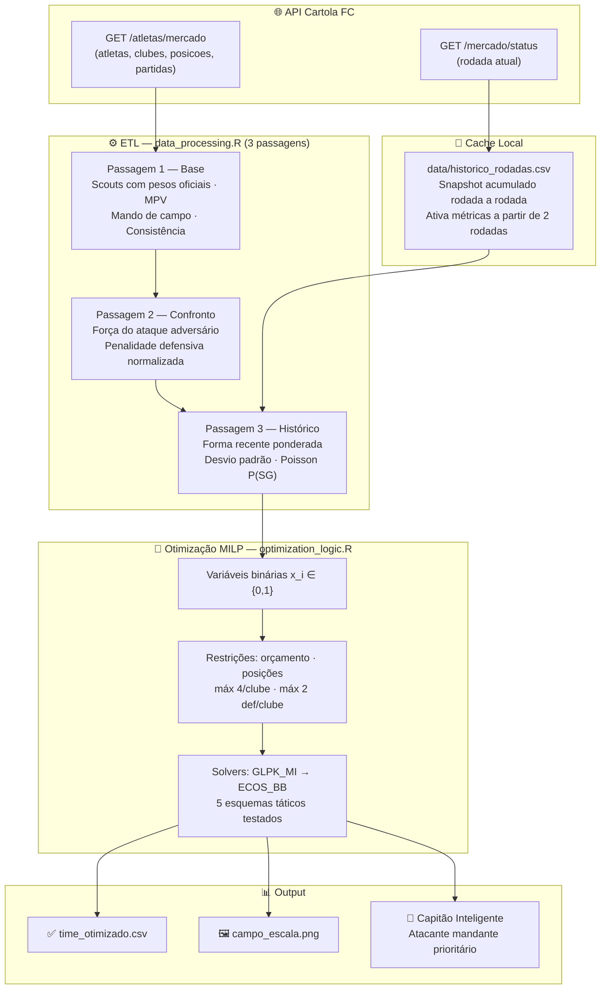

<div align="center">


# Project Cartola

**Otimização Matemática e Data Science para o Cartola FC**

[](https://www.r-project.org/)
[](https://api.cartola.globo.com)
[](https://cvxr.rbind.io/)
[](https://pt.wikipedia.org/wiki/Distribui%C3%A7%C3%A3o_de_Poisson)
[]()

</div>

---

## Sobre o Projeto

O **Project Cartola** é um sistema completo de **Data Science e Pesquisa Operacional** desenvolvido em R para maximizar o desempenho no Cartola FC. O projeto combina **Programação Linear Inteira Mista (MILP)** com um **modelo de Poisson** para calcular probabilidades de jogo sem gol, tudo alimentado por dados em tempo real da API oficial da Globo.

O sistema resolve dois problemas distintos de escalação:

- **Foco em Pontos** — maximiza a pontuação esperada na rodada, ajustada por mando de campo, força do adversário e forma recente
- **Foco em Valorização** — seleciona jogadores com alta probabilidade de superar o MPV (Mínimo Para Valorizar), acumulando patrimônio ao longo da temporada

O histórico é construído **rodada a rodada de forma automática** — quanto mais rodadas acumuladas, mais preciso o modelo se torna.

---

## Pipeline Completo

O sistema opera em um fluxo de dados bem definido, do consumo da API até a escalação visual final:



---

## O que o Sistema Faz

### 1. Escalação Multi-Esquema Automática

O otimizador testa **5 formações táticas** simultaneamente e seleciona a que produz a maior pontuação esperada dentro do orçamento:

| Esquema | Goleiro | Lateral | Zagueiro | Meia | Atacante | Técnico |
| :-----: | :-----: | :-----: | :------: | :--: | :------: | :-----: |
| 4-3-3   | 1 | 2 | 2 | 3 | 3 | 1 |
| 4-4-2   | 1 | 2 | 2 | 4 | 2 | 1 |
| 3-5-2   | 1 | 2 | 1 | 5 | 2 | 1 |
| 4-5-1   | 1 | 2 | 2 | 5 | 1 | 1 |
| **3-4-3** | **1** | **2** | **1** | **4** | **3** | **1** |

Você pode usar três modos de execução:

```bash
# Melhor esquema entre os 5 (recomendado)
Rscript scripts/executar_otimizacao.R

# Foco em pontos — esquema 4-3-3
Rscript scripts/escalar_pontos.R

# Foco em valorização — esquema 4-4-2
Rscript scripts/escalar_valorizacao.R
```

---

### 2. Fator Mando de Campo

Dados históricos do Brasileirão mostram que mandantes têm desempenho consistentemente superior. O sistema aplica multiplicadores sobre a expectativa de pontos de cada jogador:

| Situação     | Multiplicador | Efeito |
| :----------- | :-----------: | :----- |
| Mandante     | **× 1.15**    | +15% na expectativa |
| Visitante    | **× 0.90**    | −10% na expectativa |
| Sem partidas | × 1.00        | Neutro (antes da rodada abrir) |

---

### 3. Ajuste por Força do Adversário

O gol do atacante do time A **é o mesmo evento** que penaliza o goleiro do time B (−1 GS). Escalar ambos cria dependência negativa oculta. O sistema neutraliza esse problema em três etapas:

1. Calcula a `forca_ataque` de cada clube = média de `expectativa_pontos` dos atacantes e meias
2. Normaliza para $[0, 1]$ entre todos os clubes da rodada
3. Aplica penalidade de até **−25%** na expectativa dos defensores que enfrentam os ataques mais fortes

$$\text{expectativa\_def} = \text{expectativa\_base} \times \left(1 - 0.25 \times \hat{f}_{\text{adversário}}\right)$$

O otimizador naturalmente passa a priorizar defesas contra ataques fracos, maximizando P(SG).

---

### 4. Modelo de Poisson para Probabilidade de SG

<div align="center">

<br/><em>Distribuição de Poisson — gols por partida seguem este modelo (λ ≈ 1.2 no Brasileirão)</em>
</div>

<br/>

Gols por partida seguem distribuição de Poisson com parâmetro $\lambda$. O sistema estima $\lambda_j$ de cada clube a partir das últimas 5 rodadas do cache local:

$$P(\text{SG} \mid \text{adversário}_j) = P(X = 0) = e^{-\lambda_j}$$

O ajuste é aplicado **adicionalmente** à expectativa dos defensores e goleiros:

$$\Delta_{\text{SG}} = \left(P(\text{SG}) - e^{-1.2}\right) \times 5.0 \text{ pontos}$$

| Cenário | $\lambda$ | $P(\text{SG})$ | Ajuste |
| :------ | :-------: | :------------: | :----: |
| Adversário muito fraco | 0.5 | 0.61 | **+1.5 pt** |
| Adversário médio (padrão) | 1.2 | 0.30 | 0.0 pt |
| Adversário muito forte | 2.0 | 0.14 | **−0.8 pt** |

> **Fallback sem histórico:** $\lambda = 1.2$ para todos → $P(\text{SG}) \approx 0.30$ → ajuste zero (neutro)

---

### 5. Modelo Matemático MILP

<div align="center">

<br/><em>MILP: pontos vermelhos = soluções inteiras viáveis · região azul = relaxação contínua do LP</em>
</div>

<br/>

A escalação é modelada como um **Problema de Mochila Binário** com restrições adicionais:

**Variáveis de decisão:** $x_i \in \{0, 1\}$ — 1 se o jogador $i$ é escalado, 0 caso contrário

**Função objetivo:**

$$\text{Maximizar} \quad Z = \sum_{i=1}^{n} P_i \cdot x_i$$

onde $P_i$ é a `expectativa_pontos` (pontos) ou `potencial_valorizacao` (valorização).

**Restrições:**

| # | Restrição | Fórmula |
| :-: | :-------- | :------ |
| 1 | Orçamento máximo | $\sum_{i} C_i \cdot x_i \leq \text{Orçamento}$ |
| 2 | Time completo | $\sum_{i} x_i = 12$ |
| 3 | Formação tática | $\sum_{i \in \text{pos}} x_i = K_{\text{pos}}, \; \forall \text{pos}$ |
| 4 | Limite por clube | $\sum_{i \in \text{clube}} x_i \leq 4$ |
| 5 | Anti-stacking defensivo | $\sum_{i \in \text{def}(\text{clube})} x_i \leq 2$ |
| 6 | Integralidade | $x_i \in \{0, 1\}$ |

---

### 6. Score de Scouts com Pesos Oficiais

Todos os scouts disponíveis na API são computados com os **pesos oficiais do Cartola FC (2024+)**:

| Scout | Descrição | Peso | Scout | Descrição | Peso |
| :---: | :-------- | :--: | :---: | :-------- | :--: |
| **G** | Gol | +8.0 | **GC** | Gol Contra | −3.0 |
| **A** | Assistência | +5.0 | **CV** | Cartão Vermelho | −3.0 |
| **SG** | Sem Gol | +5.0 | **PP** | Pênalti Perdido | −4.0 |
| **DP** | Defesa de Pênalti | +7.0 | **GS** | Gol Sofrido | −1.0 |
| **FT** | Finalização na Trave | +3.0 | **CA** | Cartão Amarelo | −1.0 |
| **DS** | Desarme | +1.5 | **FC** | Falta Cometida | −0.3 |
| **DE** | Defesa (goleiro) | +1.3 | **I** | Impedimento | −0.1 |
| **FD** | Finalização Defendida | +1.2 | | | |
| **FF** | Finalização para Fora | +0.8 | | | |
| **FS** | Falta Sofrida | +0.5 | | | |
| **PS** | Pênalti Sofrido | +1.0 | | | |

Isso gera a métrica `media_scouts` — validação cruzada da `media_num` da API — e o índice de **consistência**:

$$\text{consistência} = \frac{\text{scouts regulares}}{\text{scouts regulares} + \text{scouts voláteis}} \in [0, 1]$$

- **0.0** → depende de gols/assistências (alta variância, "apostador")
- **1.0** → pontos vêm de DS/FF/DE/etc. (baixa variância, "consistente")

---

### 7. Cache Local e Aprendizado Progressivo

O sistema constrói seu próprio histórico sem depender de datasets externos:

```
Rodada N   →  salvar_snapshot_rodada()  →  historico_rodadas.csv
Rodada N+1 →  salvar_snapshot_rodada()  →  calcula delta → pontos_rodada real
```

A partir de **2 rodadas** no cache, as métricas avançadas ativam automaticamente:

| Métrica | Sem histórico (< 2 rodadas) | Com histórico (≥ 2 rodadas) |
| :------ | :-------------------------- | :--------------------------- |
| `forma_recente` | `media_num` da API | Média ponderada últimas 5 rodadas (pesos 5,4,3,2,1) |
| `std_pontos` | `0` (sem informação) | Desvio padrão real por rodada |
| `prob_sg` | `e^{-1.2} ≈ 0.30` (neutro) | `e^{-λ}` com $\lambda$ do cache |
| `valoriza_provavel` | `FALSE` (MPV ausente no início) | `TRUE` quando `expectativa ≥ min_val` |

---

### 8. Hierarquia de Potencial de Valorização

O cálculo do `potencial_valorizacao` usa **3 níveis de precisão** em cascata:

```
1. variacao_num da API  →  (melhor) variação real da última rodada
         ↓ se zero
2. media - min_val      →  quanto o jogador supera o MPV oficial
         ↓ se min_val = 0
3. (media × 1.5) - preco →  heurística "Bom e Barato" (rodada 1 sem histórico)
```

---

### 9. Seleção de Capitão Inteligente

O capitão recebe **1.5× na pontuação final**. O sistema pondera candidatos automaticamente:

| Perfil | Peso para Capitão |
| :----- | :---------------: |
| Atacante mandante | `expectativa × 1.5` |
| Atacante visitante | `expectativa × 1.3` |
| Meia mandante | `expectativa × 1.2` |
| Demais posições | `expectativa × 1.0` |
| Técnico | Excluído |

> ⚠️ **Atenção:** cada gol sofrido vira **−1.5 pt** com a braçadeira no goleiro. O sistema exclui automaticamente Técnicos da seleção de capitão.

---

## Arquitetura dos Módulos

```
project-cartola/
│
├── R/
│   ├── data_processing.R     # ETL em 3 passagens + todas as métricas derivadas
│   ├── cache_rodadas.R       # Snapshot por rodada · deltas · forma_recente · std_pontos
│   ├── sg_model.R            # Modelo de Poisson: estima λ e calcula P(SG) por clube
│   ├── optimization_logic.R  # MILP via CVXR: variáveis, restrições, hierarquia de solvers
│   └── visualization_logic.R # Campo tático com ggsoccer · escudos · capitão dourado
│
├── scripts/
│   ├── executar_otimizacao.R # Melhor esquema entre os 5 (uso principal)
│   ├── escalar_pontos.R      # Foco em pontos — 4-3-3 com capitão otimizado
│   ├── escalar_valorizacao.R # Foco em valorização — 4-4-2 com filtro MPV
│   └── teste_inicial.R       # Validação completa do pipeline (7 testes)
│
├── data/
│   └── historico_rodadas.csv # Cache local (gitignored · gerado automaticamente)
│
└── output/
    ├── time_otimizado.csv    # Time escalado (gitignored · gerado por rodada)
    └── campo_escala.png      # Visualização tática (gitignored · gerado por rodada)
```

---

## Dicionário de Variáveis

| Variável | Descrição | Fonte |
| :------- | :-------- | :---: |
| `atleta_id` | Identificador único do jogador | API |
| `preco_num` | Custo em Cartoletas | API |
| `media_num` | Média de pontos por partida na temporada | API |
| `variacao_num` | Variação de preço na última rodada | API |
| `minimo_para_valorizar` | MPV oficial — mínimo de pontos para valorizar | API |
| `status_id` | Status do atleta (7 = Provável) | API |
| `is_mandante` | `TRUE` se o clube joga em casa nesta rodada | Partidas |
| `expectativa_pontos` | Média ajustada por mando + adversário + forma recente | Calculada |
| `potencial_valorizacao` | Estimativa de valorização (3 níveis de precisão) | Calculada |
| `valoriza_provavel` | `TRUE` quando `expectativa_pontos ≥ min_val` | Calculada |
| `media_scouts` | Média recalculada pelos scouts com pesos oficiais | Calculada |
| `consistencia` | Proporção de pontos regulares (0 = volátil · 1 = consistente) | Calculada |
| `forca_ataque_adversario_norm` | Força normalizada $[0,1]$ do ataque do adversário | Calculada |
| `forma_recente` | Média ponderada últimas 5 rodadas; fallback = `media_num` | Cache |
| `std_pontos` | Desvio padrão das pontuações por rodada | Cache |
| `prob_sg` | $P(\text{SG}) = e^{-\lambda}$; default = 0.30 | Cache + Poisson |
| `escudo` | URL do escudo 60×60 do clube | CDN Globo |

---

## Stack Tecnológica

| Categoria | Pacotes |
| :-------- | :------ |
| **API & Dados** | `httr`, `jsonlite` |
| **Manipulação** | `dplyr`, `purrr` |
| **Otimização** | `CVXR`, `Rglpk` (solver GLPK\_MI) |
| **Visualização** | `ggplot2`, `ggsoccer`, `ggimage`, `ggrepel` |

**Solvers suportados** (ordem de preferência): `GUROBI` → `MOSEK` → `CBC` → `GLPK_MI` → `ECOS_BB`

**Fonte de dados:** [API Oficial Cartola FC](https://api.cartola.globo.com) · Referência técnica: [caRtola](https://github.com/henriquepgomide/caRtola)

---

## Como Executar

### Pré-requisitos

```r
install.packages(c(
  "httr", "jsonlite", "dplyr", "purrr",
  "CVXR", "Rglpk",
  "ggplot2", "ggsoccer", "ggimage", "ggrepel"
))
```

> No Windows, adicione `C:\Program Files\R\R-x.x.x\bin` ao PATH do sistema para usar `Rscript` em qualquer terminal.

### Fluxo por Rodada

```bash
# 1. Validar o pipeline antes de otimizar
Rscript scripts/teste_inicial.R

# 2. Gerar o time otimizado (melhor esquema entre os 5)
Rscript scripts/executar_otimizacao.R
# → output/time_otimizado.csv
# → output/campo_escala.png

# Alternativas especializadas:
Rscript scripts/escalar_pontos.R       # Foco em pontos — 4-3-3
Rscript scripts/escalar_valorizacao.R  # Foco em valorização — 4-4-2
```

### Ajustar Orçamento

Edite a variável `ORCAMENTO` no topo de qualquer script antes de executar:

```r
ORCAMENTO <- 120.0  # Seu patrimônio atual em Cartoletas
```

---

## Evolução Automática por Rodada

| Rodadas no cache | O que está ativo |
| :--------------: | :--------------- |
| **0–1** | Média bruta da API · fallbacks conservadores · `prob_sg = 0.30` para todos |
| **≥ 2** | `forma_recente` ponderada · `std_pontos` real · `prob_sg` via Poisson |
| **≥ 2** + rodada aberta | `partidas` na API → mando e força do adversário reais |
| **≥ 2** + MPV disponível | `valoriza_provavel` ativo → otimização de valorização precisa |

Basta **rodar o script a cada rodada** — o cache acumula e o modelo melhora sozinho.

---

<div align="center">

*Desenvolvido para fins analíticos. O sucesso no Cartola FC depende de variáveis aleatórias inerentes ao esporte.*

</div>
